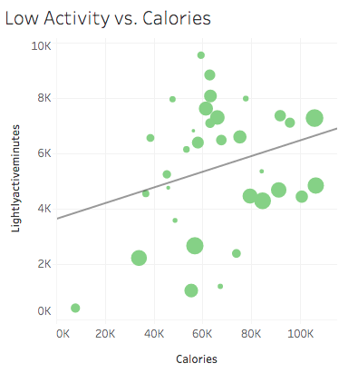

# Bellabeat Data Analysis Case Study

> **Capstone Project** – Google Data Analytics Professional Certificate
> Author: *Stelios C. Thymianos*

---

## **Introduction**

Hello and welcome to my Bellabeat case study!
This is a capstone project from the [Google Data Analytics Professional Certificate](https://www.coursera.org/professional-certificates/google-data-analytics?), which gives me the opportunity to perform a real-world task of a data analyst. The analysis follows the 6 steps of Data Analysis, that they were taught in the course:

**Ask -> Prepare -> Process -> Analyze -> Share -> Act**


Scenario:

I am a junior data analyst working on the marketing analyst team at Bellabeat, a high-tech manufacturer of health-focused products for women. Bellabeat is a successful small company, but they have the potential to become a larger player in the global smart device market. In order to unlock new growth opportunities for the company, I have been asked to focus on one of Bellabeat’s products and analyze smart device data to gain insight into how consumers are using their smart devices. The insights I discover will then help guide marketing strategy for the company. I will present my analysis to the Bellabeat executive team along with my high-level recommendations for Bellabeat’s marketing strategy.


About the company:

Urška Sršen and Sando Mur founded Bellabeat, a high-tech company that manufactures health-focused smart products. Sršen used her background as an artist to develop beautifully designed technology that informs and inspires women around the world. Collecting data on activity, sleep, stress, and reproductive health has allowed Bellabeat to empower women with knowledge about their own health and habits. Since it was founded in 2013, Bellabeat has grown rapidly and quickly positioned itself as a tech-driven wellness company for women.
By 2016, Bellabeat had opened offices around the world and launched multiple products. Bellabeat products became available through a growing number of online retailers in addition to their own e-commerce channel on their [website](https://bellabeat.com). The company has invested in traditional advertising media, such as radio, out-of-home billboards, print, and television, but focuses on digital marketing extensively. Bellabeat invests year-round in Google Search, maintaining active Facebook and Instagram pages, and consistently engages consumers on X. Additionally, Bellabeat runs video ads on Youtube and display ads on the Google Display Network to support campaigns around key marketing dates.
Sršen knows that an analysis of Bellabeat’s available consumer data would reveal more opportunities for growth. She has asked the marketing analytics team to focus on a Bellabeat product and analyze smart device usage data in order to gain insight into how people are already using their smart devices. Then, using this information, she would like high-level recommendations for how these trends can inform Bellabeat marketing strategy.


Products:<br>
- **Bellabeat app:** The Bellabeat app provides users with health data related to their activity, sleep, stress, menstrual cycle, and mindfulness habits. This data can help users better understand their current habits and make healthy decisions. The Bellabeat app connects to their line of smart wellness products.
- **Leaf:** Bellabeat’s classic wellness tracker can be worn as a bracelet, necklace, or clip. The Leaf tracker connects to the Bellabeat app to track activity, sleep, and stress.
- **Time:** This wellness watch combines the timeless look of a classic timepiece with smart technology to track user activity, sleep, and stress. The Time watch connects to the Bellabeat app to provide you with insights into your daily wellness.
- **Spring:** This is a water bottle that tracks daily water intake using smart technology to ensure that you are appropriately hydrated throughout the day. The Spring bottle connects to the Bellabeat app to track your hydration levels.
- **Bellabeat membership:** Bellabeat also offers a subscription-based membership program for users. Membership gives users 24/7 access to fully personalized guidance on nutrition, activity, sleep, health and beauty, and mindfulness based on their lifestyle and goals.


## **1. Ask**

The Ask-Phase is the first foundational step in the data analysis process. It's crucial because it sets the direction for the entire analysis and ensures that everyone, who is involved, is aligned with the business task, that the data analysis aims to solve.

**Business task:** <br>
Analyzing smart device usage data in order to gain insight into how consumers use non-Bellabeat smart devices. Then, selecting one Bellabeat product to apply these insights to in the presentation. Following three points are the questions needed to be answered by this analysis:
1. What are some trends in smart device usage?
2. How could these trends apply to Bellabeat customers?
3. How could these trends help influence Bellabeat marketing strategy?

<u><strong>Stakeholders:</strong></u><br>
Knowing the audience is key to successful communication. In this presentation, the following participants will be present:
- Urška Sršen: Bellabeat’s cofounder and Chief Creative Officer
- Sando Mur: Mathematician and Bellabeat’s cofounder; key member of the Bellabeat executive team
- Bellabeat marketing analytics team: A team of data analysts responsible for collecting, analyzing, and reporting data that helps guide Bellabeat’s marketing strategy.

## **2. Prepare**

To answer Bellabeat's business tasks I will be using [FitBit Fitness Tracker Data](https://www.kaggle.com/arashnic/fitbit) (CC0: Public Domain, dataset made available through [Mobius](https://www.kaggle.com/arashnic/)): This Kaggle data set contains personal fitness tracker from thirty (30) fitbit users. All users consented to the submission of personal tracker data, including minute-level output for physical activity, heart rate, and sleep monitoring. It includes information about daily activity, steps, and heart rate that can be used to explore users’ habits. The dataset contains 18 CSV-files and all of them are organized in long-format.
Verifying the metadata of our dataset we can confirm it is open-source. The owner has dedicated the work to the public domain by waiving all of his or her rights to the work worldwide under copyright law, including all related and neighboring rights, to the extent allowed by law. You can copy, modify, distribute and perform the work, even for commercial purposes, all without asking permission.

**ROCCC**-analysis of the dataset:
- **Reliability:** The data is identified as open-source and has a usability rating of 9.41 identified by Kaggle, meaning there is a high level of documentation. The dataset is published under the CC0: Public Domain license.
- **Original:** This dataset generated by respondents to a distributed survey via Amazon Mechanical Turk. Thirty eligible Fitbit users consented to the submission of personal tracker data.
- **Comprehensive:** Data minute-level output for physical activity, heart rate, and sleep monitoring. While the data tracks many factors in the user activity and sleep, but the sample size is small and most data is recorded during certain days of the week.
- **Current:** Data is from March 2016 to May 2016. Data is not current so the users habit may be different now.
- **Cited:** Last update was one year ago, which means there is a 1-year lag.


_Considerations:_
- Due to the limitation of size (30 users) and not having any demographic information we could encounter a sampling bias. We are not sure if the sample is representative of the population as a whole. That is why we will give our case study an operational approach.
- The dataset does not provide information about gender of the users. Bellabeat is a tech-driven wellness company for women only.
- The data is from 2016, so it is outdated as fitness trackers matured a lot since then. Also the period of the survey is limited (2 months long).
Most data is recorded from Tuesday to Thursday, which may not be comprehensive enough to form an accurate analysis.


## **3. Process**

In this phase I will clean and manipulate the data properly to set the foundation for an accurate and meaningful analysis. For this purpose, I choose to use R due to it’s accessibility [(Open Source Posit Cloud)](https://posit.cloud/) , the amount of data I will be working with and because the fact that I can create quick data visualizations to gain insights, which I can share with the stakeholders later on.
Bellow is the summary of the steps I took to complete this phase. For the detailed data cleaning report please click here.


1. Setting up the work-environment(R):
 First of all, we have to install and load all the needed packages that will aid us for the cleaning and analysis process:


2. Importing  Dataset:
Then, I am going to upload the .csv files that I 'll work with:

```
daily_activity <- read_csv("data/dailyActivity_merged.csv")
daily_calories<- read_csv("data/dailyCalories_merged.csv")
daily_steps <- read_csv("data/dailySteps_merged.csv")
daily_sleep <- read_csv("data/sleepDay_merged.csv") 
hourly_intensities <- read_csv("data/hourlyIntensities_merged.csv") 
hourly_calories <- read_csv("data/hourlyCalories_merged.csv")
hourly_steps <- read_csv("data/hourlySteps_merged.csv")
weight <- read_csv("data/weightLogInfo_merged.csv")
```

3. Previewing and checking

Next, I am going to preview the data and check its structure, by using the codes head() and str() , to understand the variables and the data types.

By checking the datasets, I noticed that there are already Calories- and Steps-data in the dataset daily_activity contained. To make sure that it so, I am going to use the “which”-function.


It turned out, that they are indeed already contained so I will drop the daily_steps and daily_calories from my analysis to avoid double and repeated data.

I am also checking the number of unique users per data frame before coming on with the cleaning process, by using the n_unique code.
All data sets have 33 except for sleep data (24) and weight data (8). I will exclude the weight data frame from the analysis since it has too little participants, compared to the other data frames and to avoid biases.


4. Cleaning and formatting

After checking the data for duplicates and missing values, there were 3 duplicates in the sleep dataset found and then removed. Next, I ensured consistency by standardizing the column names in each data frame (right syntax and same format). This is helpful for merging the datasets later on. It was also necessary to clean the date-time format in the datasets before we merged them.


5. Merging Data sets

Finally, I putted all the daily data together in one data frame and I did the same for the hourly data. Now the data is cleaned and ready for analyzing!


## **4. Analyze**

Now we are ready to conduct the data analysis to gain insights into the data and identify trends that could inform Bellabeats´s marketing strategy.  As determined by the Process step, I have a variety of data tables that measures different fitness parameters (steps, calories, distance, sleep, activity, etc) in both daily and hourly time frames. However, for organizational consistency as well as ease and simplicity, I will perform analysis on the data tables by whether observations are provided at a daily or hourly intervals. This is made possible because the “Id” column is a shared key that corresponds between each of the data tables. For an even more advanced.
Since I have to present the results of the analysis later (on phase 5. Share) to my audience, I aim to create visuals, that will convey my findings in the most efficient way as possible. For that reason, I will use the powerful visualization tool [Tableau (Public)](https://public.tableau.com/app).
With that have been saying, let´s dive deep into the data!


**Daily Activity**

Starting with the analysis of the daily activity and with the summary() function in R, we will discover some first useful insights of user behavior.

```
totalsteps    totaldistance    sedentaryminutes    calories   
 Min.   :    0   Min.   : 0.000   Min.   :   0.0   Min.   :   0  
 1st Qu.: 3790   1st Qu.: 2.620   1st Qu.: 729.8   1st Qu.:1828  
 Median : 7406   Median : 5.245   Median :1057.5   Median :2134  
 Mean   : 7638   Mean   : 5.490   Mean   : 991.2   Mean   :2304  
 3rd Qu.:10727   3rd Qu.: 7.713   3rd Qu.:1229.5   3rd Qu.:2793  
 Max.   :36019   Max.   :28.030   Max.   :1440.0   Max.   :4900


veryactiveminutes fairlyactiveminutes lightlyactiveminutes
 Min.   :  0.00    Min.   :  0.00      Min.   :  0.0       
 1st Qu.:  0.00    1st Qu.:  0.00      1st Qu.:127.0       
 Median :  4.00    Median :  6.00      Median :199.0       
 Mean   : 21.16    Mean   : 13.56      Mean   :192.8       
 3rd Qu.: 32.00    3rd Qu.: 19.00      3rd Qu.:264.0       
 Max.   :210.00    Max.   :143.00      Max.   :518.0

```

Next, I am going to find out the average activity level per day. The categories of activity are: sedentary, ligthly active, fairly active and very active. To demonstrate it in an efficient way, I will create a pie-chart. Another definitely interesting insight would be to see the average amount of steps taken during the week.


 


Insights:

- The average number of steps taken by users is 7.629.
- The average number of calories burned per day is 2.304 cal.
- Users spend 81,3 % of their time (~ 16,5 h) sitting and are very active and fairly active only in 1,74% and 1,11% (~ 35 minutes) of their active part of their day.
- The highest activity was observed at the beginning of the week. Most steps are taken on Tuesday and Saturday, and the fewest on Sunday.


**Hourly Activity**

Let´s get some insights about the user activity during the day. When are users more active?

```
Totalintensity	averageintensity    calories        	steptotal      
 Min.0.00		Min.   :0.0000  	 Min.   : 42.00   	Min.   :    0.0  
 1st Qu.:0.00		1st Qu.:0.0000  	 1st Qu.: 63.00 	1st Qu.:    0.0  
 Median :3.00		Median :0.0500   	 Median : 83.00   	Median :   40.0  
 Mean   :12.04	Mean   :0.2006    	 Mean   : 97.39     Mean   :  320.2  
 3rd Qu.:16.00 	3rd Qu.:0.2667   	 3rd Qu.:108.00     3rd Qu.:  357.0  
 Max.   :180.00 	Max.   :3.0000   	 Max.   :948.00     Max.   :10554.0

```

In order to find out on which hours during the day users are active the most, we have to separate the date_time column in date and time columns:

```r
hourly_data <- hourly_data %>%
  separate(date_time, into = c("date", "time"), sep= " ")
```

After running the code I received the message, that there were some NA-values added in the time-column. This happened only for the “00:00:00”-values, so I am going to replace them with the code:

```r
hourly_data <- hourly_data %>% mutate( time = replace_na(time, "00:00:00") )
```

Finally, I can import the dataset in Tableau, so I can create quickly dynamic visuals:

 

Insights:
- Users are most active in the morning and evening, but the peak is around 5:00pm to 7:00pm, which are times when people usually get off work.


**Activity and Calories:**

I will check the correlation between the different levels of activity (lightly, fairly and very active o) and the burned calories but also the correlation between steps and calories. The three levels of activity are lightly active (low activity), fairly active (medium activity) and very active (high activity).

<p align="center">
  
  
  
</p>

- The R-Squared value for Low Active graph is 0.06
- The R-Squared value for Fairly Active graph is 0.07
- The R-Squared value for Very Active graph is 0.38


Insights:

- There is a strong correlation between very active minutes and the amount of calories burned. The R-squared value seems to rise as the intensity increases from medium activity to high activity. The most desired time people are active throughout the day is between 7:00 AM - 8:00PM
- There is a positive correlation between the number of steps taken and the number of calories burned.


**Daily Sleep**

Analyzing daily sleep data will help us to understand user sleep patterns. Starting with the summarization of the daily_sleep dataset we have:

```
totalsleeprecords totalminutesasleep totaltimeinbed 
 Min.   :1.00      Min.   : 58.0      Min.   : 61.0  
 1st Qu.:1.00      1st Qu.:361.0      1st Qu.:403.8  
 Median :1.00      Median :432.5      Median :463.0  
 Mean   :1.12      Mean   :419.2      Mean   :458.5  
 3rd Qu.:1.00      3rd Qu.:490.0      3rd Qu.:526.0  
 Max.   :3.00      Max.   :796.0      Max.   :961.0
```

With the available sleep-data, we can find out the average sleep per weekday and also the average time users spend in bed awake. Another interesting exploration would be how often users sleep during the day and on which weekday are they more likely to do so, but we don`t know exactly how the number of sleep records were recorded. If, for an example, a user did stand up during the night for drinking some water or going to the restroom and then going to sleep again, would this be recorded as two times of sleep or still as one? Was a specific duration of break, until that the sleep will be still counted as one? Since we don’t know for sure, I will leave out this exploration to avoid drawing false conclusions.


Insights:

- The average total minutes asleep is 419.2, which is almost equal to 7 hours.
- Users tend to sleep longer on weekends compared to weekdays. Sleep time during weekdays is less than 7 hours, except for Wednesdays.
- Users spend in average almost 40 minutes in bed being awake. More than a half of them even 55 minutes.


**User Engagement**

What also matters is the user engagement with the product. I am going to check how engaged the users were with the data tracking by analyzing the number of users per date and by grouping them in full time and casual users.


Insights:

- The number of active users declined from 33 to 21 in only one month.
- Only half of the users were fully engaged in tracking their data. The other half were casual users.

## **5. Share**

It’s time to summarize the results of the analysis with the stakeholders. In order to communicate the findings effectively, I have created a dashboard with the visuals of the high-level insights.


Insights and Trends observed:

- **Data Tracking:** The majority of users primarily use the tracker for monitoring activity levels, such as steps, calories burned, and exercise intensity.
A relatively low number of users, 24, engaged with the sleep tracking feature, highlighting a potential lack of awareness of the importance of sleep.
Only 8 users were actively tracking their weight loss, suggesting an opportunity to enhance the promotion of this feature
- **User Engagement:** One-third (1/3) of the users stopped tracking their data within a month! This is a very high number and indicates potential issues with user retention or engagement.
- **Casual Usage:** Only half (50%) of wearers were utilizing the tracker consistently throughout the day. The other half were casual users.
- **Activity Level:** Users spend on average 16,5 hours a day sitting, are for 3,2 hours lightly active and only for a half-hour fairly and very active.
- **Steps and Calories Correlation:** A strong proportional relationship exists between the number of steps taken and calories burned, validating the device’s tracking accuracy.
- **Weekly Usage Patterns:** We observed the highest activity levels on Saturday and at the beginning of the week. Tuesdays and Saturdays typically see the most steps taken, with Sundays recording the fewest. Sunday seems to be the most “lazy” day for users - probably they are using the day for resting.
- **Hourly Usage Patterns:** Users are most active in the morning and evening, but the peak is around 5:00pm to 7:00pm, which are times when people usually get off work.
- **Sleep Patterns:** Users tend to sleep more on the weekend and on Wednesdays. Considering that, users were most active on Saturday and Tuesday, the observation that they got the most sleep on Sunday and Wednesday seems plausible.
Users spend in average almost 40 minutes in bed being awake – more than a half (54%) even for 55 minutes.


## **6. Act**

Finally, after we have gained insights about how customers are using smart fitness devices, I am going to make data-driven recommendations for one Bellabeat product, in order to help influence the Bellabeat marketing strategy:


Recommendation for the Bellabeat-App:

- Daily reminder for steps taken
The average number of steps taken by users is 7.629.  According to CDC taking 8,000 steps per day was associated with a 51% lower risk for all-cause mortality (or death from all causes). Taking 12,000 steps per day was associated with a 65% lower risk compared with taking 4,000 steps. Bellabeat can encourage people to take at least 8 000 explaining the benefits for their health. Sending notifications daily at peak activity times will make users conscious of the number of steps achieved so far and encourage them to meet the set target. The app can also educate users on the health benefits of walking the daily recommended number of steps.


- Highlighting the importance of sleep
As we can see from the analysis, users tend to take less than 7 hours of sleep during the week. According to leading medical and scientific organizations, specialized in sleep and in public health like the American Academy of Sleep Medicine (AASM) and the Sleep Research Society (SRS), the recommended amount of sleep for an adult is minimum 7 hours. Sleep is essential for overall health and well-being, with insufficient sleep linked to various health issues, including obesity, heart disease, and mental health problems. This is a considerable potential growth area, where Bellabeat can launch a series of blog posts, videos, and infographics on the importance of sleep health and how the Bellabeat tracker can improve sleep quality.


- Increasing user-engagement through the use of a reward system
The analysis showed a relatively low user-engagement (only half of the users were using the device consistently throughout the day), which indicates a potential area for improvement. By implementing a gamified reward system in the app, we can transform the user experience from a utility to an engaging journey, significantly boosting user engagement and fostering long-term user loyalty. This system would involve users earning points or virtual currency for in-app activities, achieving by meeting Calories-, Steps- and Sleep-goals and unlocking exclusive content or customization options.
